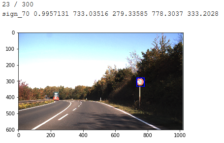

# German Traffic Signs Detection & Classification
## Introduction
In this project we will experiment different techniques for Traffic Sign Classification, then we will include our results on top of a Region Proposal Network to build a full Traffic Sign Detection system. 
This project has been developed during the Unit 3 of the Deep Learning at the Universidad Politecnica de Madrid (2019), and it has been evaluated as part of the exam.

  

## Authors
- [Manuel Scurti](https://github.com/return00000)
- [Mingjie Ye](https://github.com/Matthew-Ye)

## Dataset
[German Traffic Sign Benchmark](http://benchmark.ini.rub.de/?section=gtsrb&subsection=dataset) (GTSRB) is a multi-class classification challenge. They provide a dataset containing images capturing traffic signs in german roads.

## Experiment Design 
We divided the experiment in three steps, each one asking ourselves the following questions:
1. By only using Feed Forward Neural Networks how far can we get in classifying images of traffic signs?
2. Can we outperforms the previous results using Convolutional Neural Networks?
3. Can we still boost the performances using Transfer Learning?

Finally we took the best performing network, both in accuracy and in inference time, and included it on top of an Region Proposal Network and evaluated the results.
You can find all the process followed in the final report file called **report.pdf**
